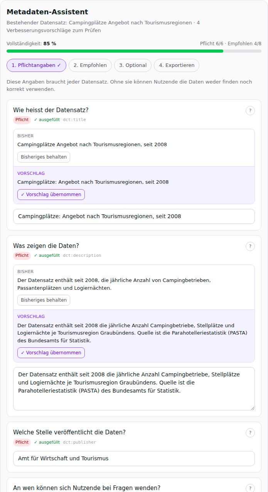

# Metadata-Wizard

MCP App für die Generierung und Verbesserung von DCAT-AP-CH-Metadaten für das
Open-Data-Portal des Kantons Graubünden ([data.gr.ch](https://data.gr.ch)).

Gebaut mit [SkyBridge](https://github.com/alpic-ai/skybridge) (TypeScript/React,
MCP-Apps-Extension). Das Host-Modell (Claude/ChatGPT) generiert die
Metadaten-Vorschläge; die App liefert Daten-Tools und die interaktive
Editor-View. Der Implementierungsplan liegt unter
[`docs/IMPLEMENTATION_PLAN.md`](docs/IMPLEMENTATION_PLAN.md).



## Tools

| Tool | Zweck |
|---|---|
| `search_datasets` | Semantische Katalogsuche auf data.gr.ch |
| `load_dataset_context` | Vollständige Metadaten (alle Templates/Sprachen), Feldschema, Beispielzeilen und Themenliste eines Datensatzes laden |
| `show_metadata_editor` | Interaktiver, geführter Metadaten-Editor (View) — mit Diff-Ansicht, wenn `existing` übergeben wird |
| `export_metadata` | Fertigen Entwurf als ODS-`metas`-JSON und Markdown-Checkliste ausgeben |

**Flow «Verbesserung»:** Host ruft `load_dataset_context` → generiert
Vorschläge → `show_metadata_editor(draft, existing)` → Nutzer prüft Feld für
Feld (Übernehmen/Ablehnen) → Export-Schritt mit Copy-Buttons fürs
Opendatasoft-Backoffice.

**Flow «Neu»:** Nutzer lädt eine Datei im Chat hoch → Host extrahiert Schema
und Beispiele → generiert einen Entwurf → `show_metadata_editor(draft)`.

## Entwicklung

```bash
npm install
npm run dev        # Dev-Server mit Playground/Emulator auf http://localhost:3000
npm run build      # Produktions-Build
npm start          # Gebauten Server starten (MCP-Endpoint: http://localhost:3000/mcp)
```

Im Playground (`http://localhost:3000/`) lassen sich alle Tools mit
Formular- oder JSON-Input aufrufen; die Editor-View wird direkt gerendert.

Das Zielportal ist über die Umgebungsvariable `DATA_PORTAL_DOMAIN`
konfigurierbar (Default: `data.gr.ch`).

## Projektstruktur

```
src/
├── server.ts               MCP-Server mit den vier Tools
├── ods.ts                  Client für die Opendatasoft Explore API v2.1
├── metadata.ts             Geteiltes Modell: Draft-Schema, Feld-Definitionen
│                           (Labels/Hilfen/Beispiele), Vokabulare, Score,
│                           ODS-Mapping und Export-Funktionen
├── helpers.ts              Typisierte SkyBridge-Hooks (useToolInfo, useCallTool)
└── views/
    ├── metadata-editor.tsx Geführter Wizard (Stepper, Score, Export)
    └── components/         Feld-Karte (Hilfe, Diff), Copy-Blöcke
```

## Status

- ✅ Phase 0 — Scaffold (SkyBridge v1.2.3, ODS-Client)
- ✅ Phase 1 — Verbesserungs-MVP (Diff-Editor, Vollständigkeits-Score, Export)
- ✅ Phase 2 — Neu-Generierung aus Uploads (Editor ohne Bestand), Fullscreen-Modus
- ⬜ Phase 3 — Mehrsprachigkeit (it/rm/en), Usability-Test
- ⬜ Phase 4 — Validierung (pySHACL), Write-back (siehe Plan)
